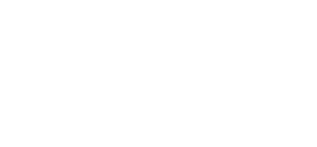

# BNOS Console — Bionic Neural Networkaa Visual Orchestration Platform

🌍 **Language Selection**: [中文](README_CN.md) | **English**

<div align="center">




</div>

<div align="center">


**A Pure Desktop Bionic Visual Orchestration Platform**

[Quick Start](#-quick-start) • [Features](#-core-features) • [Architecture](#-architecture) • [User Guide](#-user-guide) • [Developer Guide](#-developer-guide)

</div>


---

> 📋 **See [changelogs](docs/changelogs) for recent changes** | [English Changelog](docs/changelogs/en/README.md)

---

## 📖 Overview

**BNOS (Bionic Neural Network Program Operating System)** is a desktop-based visual orchestration platform built with **PySide6**, designed for the BNOS Bionic Neural Network Node System. It provides graphical configuration, drag-and-drop neural circuit construction, and real-time monitoring capabilities.

**Multi-Language Support**: The platform supports nodes implemented in **Python, Rust, Node.js, Go, Java, C++, and Ruby**, enabling developers to leverage the strengths of different programming languages within a single neural network architecture. Each node runs in an isolated environment with native performance characteristics.

> ⚠️ **Note**: Currently only **Python** and **Rust** nodes are fully implemented. Node.js, Go, Java, C++, Ruby and other language nodes are under development and not yet fully functional.

### 🎯 Problem Statement

Traditional distributed neuron systems face these challenges:

1. **Complex Configuration**: Manual JSON editing is error-prone and path mapping is tedious
2. **Unclear Relationships**: Hard to visualize data flow and dependencies between neurons
3. **Difficult Monitoring**: No real-time visibility into neuron status, logs, and errors
4. **Environment Chaos**: Dependency conflicts across multiple independent runtime environments

**BNOS Solution**: Visual canvas, automatic path configuration, real-time monitoring, and one-click lifecycle management.

### 🔍 BNOS vs Low-Code Platforms

While BNOS may appear similar to low-code platforms at first glance, there are fundamental differences in philosophy, architecture, and use cases:

| Aspect | **BNOS Platform** | **Traditional Low-Code Platforms** |
|--------|-------------------|------------------------------------|
| **Core Philosophy** | Code-first with visual orchestration | Visual-first with limited code extension |
| **Node Implementation** | Full programming language support (Python, Rust, Go, Java, etc.) with complete IDE integration | Pre-built components with restricted customization |
| **Execution Model** | Each node runs as an independent process with isolated environment | Centralized runtime engine managing all components |
| **Extensibility** | Unlimited - write any logic in any supported language | Limited to platform-provided plugins or scripts |
| **Performance** | Native performance per node (compiled languages like Rust achieve 10-100x speedup) | Constrained by platform's interpretation layer |
| **Dependency Management** | Per-node virtual environments prevent conflicts | Shared dependencies may cause version conflicts |
| **Debugging** | Standard debugging tools (VSCode, terminal, logs) per node | Platform-specific debuggers with limited capabilities |
| **Portability** | Nodes are standalone applications, easily migratable | Tightly coupled to platform, difficult to extract |
| **Learning Curve** | Requires programming knowledge but offers full control | Easier to start but hits ceiling quickly |
| **Use Cases** | Complex AI agents, distributed systems, research experiments | Simple workflows, business automation, rapid prototyping |
| **Data Flow** | File-based communication (JSON) with attention mechanism filtering | Proprietary messaging protocols |
| **Deployment** | Each node can be deployed independently | Must deploy entire platform |

#### Key Advantages of BNOS:

✅ **True Programming Power**: Not limited by visual abstractions - write complex algorithms, integrate any library, implement custom protocols  
✅ **Language Flexibility**: Mix Python for ML, Rust for performance-critical paths, Go for concurrency - all in one network  
✅ **Independent Evolution**: Each node evolves independently, no platform upgrade required  
✅ **Research-Friendly**: Perfect for experimenting with neural architectures, attention mechanisms, emergent behaviors  
✅ **Production-Ready**: Nodes are standard applications that can run anywhere, not locked into a platform  

#### When to Choose Low-Code:

- Rapid prototyping without coding skills
- Simple business workflows (approval processes, form handling)
- Non-technical users need to build automations
- Standard CRUD operations with predefined connectors

#### When to Choose BNOS:

- Building complex AI agent systems
- Research on neural networks and emergent behaviors
- Performance-critical distributed processing
- Need for full control over implementation details
- Long-term maintainability and portability requirements

**In Summary**: BNOS is a **visual orchestration layer for real code**, not a replacement for programming. It combines the clarity of visual design with the power of traditional development, making it ideal for sophisticated neural network applications where low-code platforms fall short.


---

## 🔗 Node Internal Mechanism Documentation

For developers who want to understand the detailed technical implementation of BNOS nodes, we provide a comprehensive external documentation repository covering:

- **Node Communication Mechanism**: File-based JSON communication protocol and data flow
- **Attention Filtering System**: How nodes filter and process incoming data using attention rules
- **Virtual Environment Isolation**: Per-node environment management and dependency isolation strategies
- **Process Lifecycle Management**: Node startup, monitoring, shutdown, and error recovery mechanisms
- **Configuration Structure**: Detailed explanation of config.json fields and their effects

📚 **[View Node Technical Documentation →](https://github.com/LiuStar656/Bionic-Neural-Network-Operating-System)**

📘 **[BNOS Platform Technical Documentation →](docs/TECHNICAL_DOCUMENTATION.md)** — Architecture design, core component details, IPC communication, lifecycle management, and complete project line count statistics

This documentation provides deep technical insights beyond what's covered in this README, helping developers understand how nodes work internally and how to create custom implementations.


---

## ✨ Core Features

### 🎨 Visual Neural Network Orchestration

- **Infinite Canvas**: Mouse wheel zoom (0.1x-5.0x), right-click drag pan, free-form neuron layout
- **Drag & Drop**: Drag neurons from list to canvas with automatic position calculation to avoid overlaps
- **Smart Synapse Connections**: Click output anchor → input anchor, auto-configure upstream/downstream paths
- **Straight Line System**: ComfyUI-style orthogonal lines, each segment midpoint has a draggable blue fold handle; long-press + drag to create fold waypoints
- **Multi-select Support**: Hold Ctrl to select multiple neurons for batch operations

### 🖥️ VSCode-Style Dark Interface

- **Black Frameless Window**: VSCode-inspired dark theme (`#1e1e1e`), menu bar inline with title bar
- **Custom Title Bar**: Minimize/maximize/close buttons, double-click to maximize, drag to move
- **Global Dark Theme**: Menus, scrollbars, inputs, tables, dialogs all in dark style

### ⚡ High-Performance Canvas Rendering

- **Viewport Culling**: Only renders elements within visible area, minimizing wasted draws
- **Background Caching**: Grid background cached, no redraw during pan/zoom
- **Smart Refresh**: Only repaints changed regions, smooth panning and zooming without lag

### 🩺 Process Health Detection

- **PID File Persistence**: Writes `.pid` on start, deletes on stop for traceable node status
- **Cross-Session Recovery**: GUI restart auto-scans `.pid` to detect background processes, restores ● running state
- **Periodic Health Check**: Polls running processes every 3s, crashed nodes auto-marked ○ stopped
- **Atomic Process Tree Kill**: `taskkill /F /T` ensures child processes terminate synchronously with parents, eliminating zombie processes
- **PID-Priority Detection**: `OpenProcess` for direct process liveness check, 10x+ performance improvement

### 🔄 Photoshop-Style History Rollback

- **Command Pattern**: All canvas operations (node add/delete/move, edge add/delete) auto-recorded as reversible Commands
- **HistoryManager Singleton**: Flat command list + current_index pointer, supports undo/redo/jump to any history state
- **HistoryPanel UI**: Visual history list showing operation descriptions and timestamps, click any entry to jump
- **Precise Anchor Restoration**: Multi-port undo/redo correctly restores anchor bindings, no fallback to default anchor
- **Auto-Recording**: Edge creation/deletion, node movement, etc. auto-recorded — no manual trigger needed

### 🖱️ Unified Selection System

- **Single/Box/Ctrl+Click** all use unified `box_selected_nodes`
- Box-selected nodes support **group dragging**, right-click menu adapts to single/multi selection
- Dragging nodes **auto-pushes** away adjacent nodes to prevent overlap
- Node expand button `>>` for quick output/config access

### 🔍 IDE Auto-Scanner & Right-Click Menu Action Integration

- **Cross-platform IDE Detection**: Automatically detects locally installed VSCode and Trae IDE
- **Four-layer Detection Chain**: Memory cache → app_config persistence → PATH command → environment variable / process scan → file system scan
- **Non-standard Path Support**: Through environment variable derivation and process scanning, covers custom drive letters (e.g., `F:\Trae CN\`)
- **Action System Driven**: All IDE functions (Open VSCode, Open Trae IDE, `.code-workspace` generation) registered in the unified Action system
- **Canvas Right-click Menu**: Quick IDE access from both single-node and blank-area menus
- **Node Config Dialog**: Quick access buttons for VSCode workspace and Trae IDE
- **Global Singleton**: `ide_scanner` global singleton, results persisted to `app_config.json`

### 🎯 Node Style System

- **Rect Nodes** (default): Standard rectangular style with full anchors, expand button, status indicators
- **Dot Nodes**: Compact circular style with three-layer z-architecture (indicator > input > output), text below left-aligned
- **Detailed Nodes** (ComfyUI-style): Renders parameter editing controls directly on the canvas, supports 11 parameter types (string/text/password/int/float/bool/enum/file/directory/color/range), parameter changes written back to `config.json` in real time
- **Style Persistence**: Each node's style auto-saved to `canvas_layout.json`, fully restored on restart
- **Selection Ring**: Dot nodes display a floating selection ring (z=10) on selection
- **Precise Size Restoration**: Switch freely between Detailed ↔ Rect ↔ Dot modes with no widget residues or size drift

### 📂 Project Management

- **VSCode-like Workflow**: Open folder as project, auto-detect `nodes/` directory
- **Auto-save & Recovery**: Persist window state, splitter ratio, last opened project
- **Layout Isolation**: Each project's neuron positions saved independently to `canvas_layout.json`
- **State Persistence**: Complete restoration of network topology after restart

### 🔧 Neuron Lifecycle Management

- **7 Language Support**: Python, Node.js, Go, Java, C++, Rust, Ruby
- **One-click Creation**: Graphical wizard generates standardized templates with isolated venv environments
- **Smart Renaming**: Right-click rename synchronously updates folder, config, and canvas references
- **Independent Runtime**: Each neuron has its own virtual environment, preventing dependency conflicts
- **🚀 Enhanced Rust Nodes** (NEW):
  - **Self-Healing Architecture**: Automatic detection and repair of missing/corrupted build artifacts
  - **Dual Binary System**: Separate executables for processing (`{node_name}`) and listening (`{node_name}_listener`)
  - **Performance Optimization**: Release mode builds with LTO, achieving 10-100x speedup over interpreted languages
  - **Memory Safety**: Compiler-enforced ownership model eliminates data races and memory leaks
  - **Auto-Rebuild on Startup**: Validates Rust toolchain and binaries, rebuilds if necessary before execution
  - **Modular Design**: Clean separation of concerns (main.rs, listener.rs, packet.rs)
  - **Cross-Platform Launchers**: Platform-specific startup scripts with environment validation

### ⚙️ Configuration Editor

- **Double-click Edit**: Quick access to `config.json` via double-click or right-click menu
- **Attention Mechanism Rules**: Visual table editor for filter rules (add/delete/modify/query)
- **Real-time Validation**: Changes take effect immediately without neuron restart
- **Terminal Integration**: One-click terminal launch with activated venv for debugging
- **Detailed Mode Editing**: Switch nodes to detailed view to edit 11 parameter types directly on the canvas — changes instantly written back to `config.json` (supports `parameters` field declarations)

### 📊 Real-time Monitoring

- **Status Indicators**: Green (running) / Gray (stopped) lights for instant status awareness
- **Log Viewer**: Real-time `listener.log` streaming with scrollback history
- **Process Control**: One-click start/stop with process group cleanup
- **Error Alerts**: Immediate feedback for startup failures and configuration errors

### 📦 Dynamic Resource Manager

BNOS's core resource abstraction layer, treating nodes, groups, and mounts as unified manageable resources with runtime discovery, registration, organization, and lifecycle management.

**Node Registry**
- **Persistent Records**: `node_registry.json` stores each node's name, path, mount source, and last active time
- **Scan-First Principle**: On restart, scans `nodes/` directory first; registry serves as auxiliary data source
- **Missing Detection**: Registered nodes with missing directories auto-marked as `missing`, preserving history

**External Node Mounting**
- **Cross-Project Reuse**: Select an external node folder; identified via `config.json` and mounted into current project (no file copy)
- **Locked Group Protection**: Auto-creates locked groups (🔒) named by absolute path; nodes cannot be moved in/out; source files preserved
- **Same-Source Sub-grouping**: Mounted nodes from the same root can freely create sub-groups within the locked group
- **Safe Unmount**: Right-click unmount keeps source files intact, only removes project association

**Node Group Management**
- **Flat Organization**: Groups are independent and parallel (like Photoshop layers), no nesting
- **Drag-to-Group**: Drag nodes in the list to move them in/out of groups; supports batch operations
- **Auto-Cleanup**: Empty groups are auto-deleted (except locked groups)
- **Color Coding**: Each group can have a custom color for visual distinction

### 🎯 Smart UI Features

- **Toast Notifications**: Non-intrusive pop-up notifications with advanced queue management
  - ✅ **Queue Management**: FIFO ordering, max 3 visible at once
  - ✅ **Smart Replacement**: Same node/operation hints auto-replace (e.g., "Starting" → "Started")
  - ✅ **Priority Display**: Status hints shown first for immediate feedback
  - ✅ Auto-fade in/out animations (300ms)
  - ✅ Boundary detection prevents screen overflow
  - ✅ Fixed at top-right corner, follows window movement
  
- **Node List Panel**: Floating panel fixed at top-left corner
  - ✅ Always visible, follows window movement
  - ✅ Tree structure with node groups support
  - ✅ Multi-select with Ctrl/Shift keys
  - ✅ Context-aware right-click menu
  
- **Context-Aware Menus**: Dynamic menus based on selection state
  - Single node: Start, Stop, Rename, Delete, Add to Canvas
  - Multiple nodes: Batch start/stop, batch move to group
  - Group: Start all nodes in group, expand/collapse
  - Empty area: Create group, refresh, select all

### 💾 Data Persistence

- **Debounce Save**: Auto-save 500ms after canvas changes (movement, connections, zoom)
- **Complete Recovery**: Restore positions, connections, zoom level, scroll position
- **Exception Handling**: Auto-backup corrupted JSON as `.bak` files
- **Color Settings**: Customizable node colors persisted per project
- **Config Validation**: `canvas_layout.json` loading cross-validates against each node's `config.json` `listen_upper_file`, auto-repairing missing edges — config is the source of truth
- **Drawing Toolbar State**: Drawing toolbar display state persisted to `app_config.json`, auto-restores after restart, one-click toggle works effectively


---

## 🏗️ Architecture

```mermaid
graph TB
    title BNOS System Architecture
    GUI["🖥️ BNOS GUI (PySide6)"]
    Panel["📋 Node List Panel<br/>(Top-Left)"]
    Canvas["🎨 Neural Network Canvas<br/>[Nodes & Synapses]"]
    FS["📁 Local File System<br/>(nodes/)"]
    N1["🧠 Neuron_1<br/>(venv)"]
    N2["🧠 Neuron_2<br/>(venv)"]
    NN["🧠 Neuron_N<br/>(venv)"]
    
    GUI --> Panel
    GUI --> Canvas
    Panel -->|config.json| FS
    Canvas -->|read/write| FS
    FS --> N1
    FS --> N2
    FS --> NN
```

### Module Structure

| Module | File | Description |
|--------|------|-------------|
| **Entry Point** | `bnos_console.py` | Initialize QApplication, launch MainWindow |
| **Main Window** | `ui/main_window/__main__.py` | Integrated UI hub (< 500 lines, 7 Mixin modules) |
| **Main Window Mixins** | `ui/main_window/*.py` | State, Lifecycle, Actions, Panel, IPC, NodeControl, Interaction |
| **ApplicationContext** | `ui/core/application_context.py` | Singleton aggregator for all global services |
| **Canvas** | `ui/canvas/canvas_view.py` | QGraphicsView node rendering, dragging, edges |
| **CanvasHost** | `ui/core/canvas_host.py` | Canvas host and panel docking management |
| **Node Styles** | `ui/canvas/items/styles/` | Node style system (rect/dot/detailed), StyleRegistry, 3-layer z-architecture |
| **Node List** | `ui/panels/node_list_panel.py` | Tree view, groups, drag-drop, multi-select |
| **Property Panel** | `ui/panels/property_panel.py` | Config editor, log viewer, process control, colors |
| **Expand Panel** | `ui/panels/node_expand_panel.py` | output.json viewer/editor with live refresh |
| **Node Monitor** | `ui/panels/node_monitor.py` | Real-time logs for all canvas nodes |
| **Group Manager** | `ui/panels/node_group_manager.py` | Node group CRUD and persistence |
| **Floating Panel** | `ui/core/floating_panel.py` | Base class for frameless translucent panels |
| **Logger** | `ui/core/logger.py` | Global logger with rotation (console + file) |
| **IDE Scanner** | `ui/core/ide_scanner.py` | Auto-detects VSCode / Trae IDE, 4-layer detection chain |
| **Parameter Parser** | `ui/core/node_config_parser.py` | Parses parameters field from node config.json |
| **Parameter Widget Library** | `ui/canvas/parameter_widgets/` | Qt widget library for 11 param types with WidgetRegistry                       |
| **Toast Queue** | `ui/core/toast/toast_queue_manager.py` | Toast notification queue management |
| **Action System** | `ui/core/actions/` | Unified action registry and factory |
| **EventBus** | `ui/core/event_bus.py` | Global event publishing/subscription system |
| **DIContainer** | `ui/core/di.py` | Dependency injection container |
| **PollingManager** | `ui/core/polling_manager.py` | Unified polling for node status, logs, config |
| **ProcessManager** | `ui/core/process_manager.py` | Process lifecycle management with IPC |
| **NodeControlService** | `ui/core/node_control_service.py` | Node control service with global state |
| **Menu Manager** | `ui/menu/menu_manager.py` | Unified menu bar (File/Edit/Tools/Help) |
| **History Manager** | `ui/core/commands/history_manager.py` | Photoshop-style history rollback, flat command list + current_index |
| **Command System** | `ui/core/commands/` | Command pattern: node_commands / edge_commands / base |
| **Node Creator** | `ui/creators/node_creator_manager.py` | Multi-language node creation manager |
| **Validators** | `ui/core/validators.py` | Node name and path validation utilities |
| **Tools** | `tools/python_create_node.py` | Python node template generator (venv + scripts) |

---

### 📖 Module Documentation

Detailed documentation for each major module:

| Module | Directory | Documentation |
|--------|-----------|---------------|
| **Canvas System** | `ui/canvas/` | [Canvas Module README](ui/canvas/README.md) — Canvas view, layout persistence, connection management, batch operations, drawing layer |
| **Canvas Items** | `ui/canvas/items/` | [Items Module README](ui/canvas/items/README.md) — NodeItem, EdgeItem, AnchorItem, AnchorManager, NodeStyle (3 styles, multi-anchor) |
| **Core Infrastructure** | `ui/core/` | [Core Module README](ui/core/README.md) — EventBus, DIContainer, ProcessManager, PollingManager, Action System (50+ actions), Toast, i18n, Theme, IDE Scanner, Configuration Parser |
| **Change Log** | `docs/changelogs/` | [Changelog Index](docs/changelogs/README.md) — Version history, with Chinese and English versions per release |

---

## 🚀 Quick Start

### Prerequisites

- **Python**: 3.12 or higher
- **OS**: Windows 10/11 (primary), Linux/macOS (partial support)
- **Disk Space**: 500MB+ (for virtual environments)

### Installation

#### Option 1: From Source (Recommended for Development)

```bash
# 1. Clone repository
git clone https://github.com/LiuStar656/BNOS---Bionic-Neural-Network-Visual-Orchestration-Platform.git
cd "BNOS---Bionic-Neural-Network-Visual-Orchestration-Platform-main"

# 2. Create virtual environment
python -m venv myenv_new

# 3. Activate environment
# Windows:
myenv_new\Scripts\activate
# Linux/macOS:
source myenv_new/bin/activate

# 4. Install dependencies
pip install -r requirements_gui.txt

# 5. Launch application
python bnos_gui.py
```

#### Option 2: Using Startup Script (Windows)

```powershell
# PowerShell (for paths with spaces)
& ".\start_bnos_gui.bat"

# Or CMD
start_bnos_gui.bat
```

> **Note**: First run will automatically check and install PySide6 if missing.

### Your First Project

1. **Create Project**
   ```
   Toolbar → New Project → Select Folder
   ```
   System creates `nodes/` directory automatically.

2. **Create Neurons**
   ```
   Toolbar → New Node → Enter Name → Select Language → OK
   ```
   Generates complete structure: `config.json`, `main.py`, `listener.py`, `start.bat`, `venv/`

3. **Add to Canvas**
   ```
   Right-click node in list → ➕ Add to Canvas
   ```
   Nodes appear with auto-calculated positions.

4. **Connect Neurons**
   - Click and hold **OUT** anchor (blue dot) on source node
   - Drag to **IN** anchor (green dot) on target node
   - Release to create synapse (auto-configures paths)

5. **Start Neurons**
   ```
   Double-click node → Click ▶️ Start
   ```
   Status light turns green when running.


---

## 📋 User Guide

### Node Management

#### Creating Nodes
```
Toolbar → New Node → Name + Language → OK
```
- Supported: Python, Node.js, Go, Java, C++, Rust, Ruby
- Auto-generated: Config, templates, startup scripts, isolated venv

#### Renaming Nodes
```
Right-click → ✏️ Rename → New Name → OK
```
- Updates: Folder name, `node_name` in config, canvas display
- Validates: Unique name, alphanumeric + underscores only

#### Deleting Nodes

**Option 1: Remove from Canvas Only** (Recommended for batch operations)
```
Right-click on canvas → Delete Selected Nodes
```
- Removes nodes from canvas view only
- Does NOT delete source files or configurations
- Safe for temporary cleanup

**Option 2: Complete Deletion**
```
Right-click node in list → 🗑️ Delete → Confirm
```
- Removes entire node folder from disk
- Cleans up related synapses and path configurations
- ⚠️ **Irreversible action** - use with caution

#### Adding to Canvas
```
Right-click → ➕ Add to Canvas
```
- Auto-layout: Avoids overlaps with existing nodes
- First node: Position (200, 150)
- Subsequent: Offset (50, 50) from bottom-right node

### Canvas Operations

#### Navigation
- **Pan**: Ctrl + Left-click drag on empty area (hand cursor)
- **Zoom**: Ctrl + Mouse wheel (0.1x - 5.0x), centered on mouse position
- **Scroll**: Single mouse wheel for vertical scrolling
- **Select**: Left-click on node
- **Multi-select**: 
  - Ctrl + Click nodes (toggle selection)
  - Left-click drag on empty area (box selection with blue rectangle)

#### Node Manipulation
- **Move**: Drag node body (not anchors)
- **Synapses Update**: Bezier curves follow in real-time
- **Auto-save**: Positions saved 500ms after drag stops

#### Synapse Management
- **Create**: OUT anchor → IN anchor
- **Delete**: Right-click synapse → Delete Connection
- **Clear All**: Toolbar → Clear Connections

#### View Control
- **Reset**: Toolbar → Reset View (1.0x zoom, centered)
- **Fit Content**: Coming soon

### Node Groups

#### Creating Groups
```
Right-click empty area → Create Group → Enter Name
```

#### Managing Groups
```
Right-click group → Expand/Collapse
Right-click node → Move to Group → Select Group
```

#### Batch Operations
```
Ctrl + Click multiple nodes → Right-click → Batch Start/Stop
Right-click group → Start All Nodes in Group
```

### Configuration Editing

#### Opening Config Dialog
```
Method 1: Double-click canvas node
Method 2: Right-click → ⚙️ Edit Config
Method 3: Canvas node right-click → ⚙️ Open Config
```

#### Configuration Fields

| Field | Type | Description | Example |
|-------|------|-------------|---------|
| `node_name` | string | Unique identifier | `"data_processor"` |
| `language` | string | Programming language | `"Python"` |
| `listen_upper_file` | string | Upstream output path (auto-set) | `"../node_1/output.json"` |
| `output_type` | string | Output data type | `"data_result"` |
| `filter` | array | Attention mechanism rules | `[{"key": "type", "value": "task"}]` |

#### Filter Rules Editor
- **Add**: Click "➕ Add Rule"
- **Delete**: Select row → "➖ Delete Rule"
- **Edit**: Double-click cell
- **Empty Array**: No filtering, process all tasks

#### Quick Actions
- **💻 Terminal**: Open terminal with activated venv (Windows: CMD, macOS: Terminal, Linux: gnome-terminal/konsole)
- **📁 Explorer**: Open node folder in file explorer
- **🔧 VSCode Workspace**: Generate `.code-workspace` file and open in VSCode with configured Python interpreter
- **🌟 Trae IDE**: Open node folder directly in Trae IDE (auto-detects installation path, including non-standard locations)
- **▶️/⏹️ Start/Stop**: Control node process
- **📄 Logs**: View `listener.log` in real-time

### Project Management

#### Opening Projects
```
Toolbar → Open Project → Select Folder
```
- Auto-detects `nodes/` directory
- Loads all nodes to list
- Restores canvas layout if available

#### Creating New Projects
```
Toolbar → New Project → Select Folder
```
- Creates empty `nodes/` directory
- Clears canvas and node list

#### Auto-Recovery
- Reopens last project on startup
- Restores window state, splitter ratio
- Recovers canvas topology and view state


---

## 🔧 Developer Guide

### Project Structure

```
BNOS/
│
├── bnos_console.py                # Main entry point
├── build_bnos.spec                # PyInstaller spec
├── app_config.json                # App settings (window state, last project)
├── canvas_layout.json             # Canvas layout persistence
├── color_settings.json            # Color settings persistence
│
├── tests/                         # Unit tests (Pytest)
│   ├── __init__.py
│   ├── test_validators.py        # Node name and path validation
│   ├── test_app_config.py        # Config persistence
│   ├── test_event_bus.py         # Event publishing/subscription
│   ├── test_di_container.py       # Dependency injection container
│   ├── test_polling_manager.py    # Polling manager
│   └── ...                       # Other test modules
│
├── ui/                            # UI modules
│   ├── __init__.py
│   ├── canvas_widget.py          # Compatibility layer (Facade)
│   │
│   ├── main_window/               # Main window module (split into 7 Mixins)
│   │   ├── __init__.py
│   │   ├── __main__.py           # Main window hub (~499 lines)
│   │   ├── state.py              # State management Mixin
│   │   ├── lifecycle.py          # Lifecycle events Mixin
│   │   ├── actions.py            # Business actions Mixin
│   │   ├── panel.py              # Panel management Mixin
│   │   ├── ipc.py                # IPC communication Mixin
│   │   ├── node.py               # Node control Mixin
│   │   └── interaction.py         # User interaction Mixin
│   │
│   ├── core/                      # Core components & services
│   │   ├── app_config.py         # App config persistence (atomic writes)
│   │   ├── application_context.py # ApplicationContext singleton
│   │   ├── theme.py              # Dark QSS theme
│   │   ├── node_process.py       # Node process management
│   │   ├── dark_title_bar.py     # VSCode-style title bar
│   │   ├── floating_panel.py     # Floating panel base class
│   │   ├── logger.py             # Global logger with rotation
│   │   ├── i18n.py               # Internationalization support
│   │   ├── validators.py         # Node name & path validation
│   │   ├── event_bus.py          # Event publishing/subscription
│   │   ├── di.py                 # Dependency injection container
│   │   ├── polling_manager.py    # Unified polling manager
│   │   ├── process_manager.py    # Process lifecycle with IPC
│   │   ├── node_control_service.py # Node control service
│   │   ├── shutdown_orchestrator.py # Shutdown sequence management
│   │   ├── panel_manager.py      # Panel management service
│   │   ├── dock_manager.py       # Dock panel manager
│   │   ├── canvas_host.py        # Canvas host and docking
│   │   ├── shortcut_manager.py   # Keyboard shortcut manager
│   │   ├── node_registry.py      # Node registry system
│   │   ├── ide_scanner.py        # IDE auto-detection
│   │   ├── node_config_parser.py # Parameter field parser
│   │   ├── window_state_manager.py # Window state persistence
│   │   ├── external_node_manager.py # External node mounting
│   │   ├── import_export_manager.py # Node import/export
│   │   ├── ipc.py                # IPC server/client
│   │   ├── commands/             # History rollback command system
│   │   │   ├── base.py           # Command base class
│   │   │   ├── history_manager.py # HistoryManager singleton
│   │   │   ├── node_commands.py  # Node operation commands
│   │   │   └── edge_commands.py  # Edge operation commands
│   │   ├── utils/                # Utility modules
│   │   │   ├── dialog_utils.py
│   │   │   ├── file_utils.py
│   │   │   └── log_viewer.py
│   │   ├── toast/                # Toast notification system
│   │   │   ├── toast_notification.py
│   │   │   └── toast_queue_manager.py
│   │   └── actions/              # Unified action system
│   │       ├── __init__.py
│   │       ├── action_definition.py
│   │       ├── action_registry.py
│   │       ├── action_factory.py
│   │       ├── builtin_project_actions.py
│   │       ├── builtin_node_actions.py  # Redirect → node/ subpackage
│   │       ├── builtin_canvas_actions.py
│   │       ├── builtin_view_actions.py
│   │       └── node/              # Node-related actions (Registry-based)
│   │           ├── __init__.py        # register_node_actions() aggregator
│   │           ├── _lifecycle.py / _context_menu.py / _batch.py
│   │           ├── _selection.py / _group.py / _ungrouped.py
│   │           └── _ide.py / _style.py
│   │
│   ├── menu/                      # Menu system
│   │   └── menu_manager.py       # Menu bar manager
│   │
│   ├── canvas/                    # Canvas engine
│   │   ├── __init__.py
│   │   ├── canvas_view.py        # NodeCanvas controller
│   │   ├── canvas_colors.py      # Color management Mixin
│   │   ├── canvas_layout.py      # Layout persistence Mixin
│   │   ├── canvas_menus.py       # Context menu Mixin
│   │   ├── canvas_connections.py # Synapse connection management
│   │   ├── canvas_batch_ops.py   # Batch operations
│   │   ├── canvas_box_select.py  # Box selection
│   │   ├── canvas_process.py     # Canvas process isolation
│   │   ├── controllers.py        # Canvas controllers
│   │   ├── draw_layer.py         # Drawing layer
│   │   ├── draw_toolbar.py       # Drawing toolbar
│   │   └── items/                # Graphics items
│   │       ├── __init__.py
│   │       ├── anchor_item.py    # Anchor (I/O port)
│   │       ├── anchor_manager.py # Anchor management
│   │       ├── node_item.py      # Node container
│   │       ├── node_status_widget.py
│   │       ├── edge_item.py      # Bezier curve edge
│   │       ├── styles/           # Node style system (Registry-based)
│   │       │   ├── __init__.py   # StyleRegistry + re-exports
│   │       │   ├── _base.py      # NodeStyle base class
│   │       │   ├── rect.py       # RectNodeStyle + Dark/Light variants
│   │       │   ├── dot.py        # DotNodeStyle
│   │       │   └── detailed.py   # DetailedNodeStyle
│   │       └── node_style.py     # Compatibility redirect
│   │
│   ├── graphic_items/             # Drawing graphics (Registry-based)
│   │   ├── __init__.py            # GraphicRegistry + re-exports
│   │   ├── _base.py               # GraphicBase + constants
│   │   ├── rect.py / round_rect.py / polygon.py / arrow.py / text.py
│   │
│   ├── parameter_widgets/         # Parameter widgets (Registry-based)
│   │   ├── __init__.py            # WidgetRegistry + re-exports
│   │   ├── _base.py               # ParameterWidget base + constants
│   │   └── string.py / text.py / int_widget.py / ... (11 types)
│   │
│   ├── panels/                    # Panels
│   │   ├── node_list_panel.py    # Node list panel
│   │   ├── node_list_dock.py     # Dock-style node list
│   │   ├── node_list_context.py  # Context menu for node list
│   │   ├── node_list_drag.py     # Node list drag-drop
│   │   ├── node_list_ops.py      # Node list operations
│   │   ├── property_panel.py     # Config dialog + color settings
│   │   ├── node_group_manager.py # Group management
│   │   ├── node_expand_panel.py  # Node expand panel
│   │   ├── node_monitor.py       # Node monitor (live logs)
│   │   ├── node_monitor_dock.py  # Dock-style node monitor
│   │   ├── resource_monitor.py   # Resource monitor
│   │   ├── resource_monitor_dock.py
│   │   ├── history_panel.py      # History panel
│   │   ├── panel_process.py      # Panel process isolation
│   │   └── _shared/              # Shared panel components
│   │       ├── node_log_sub_panel.py
│   │       ├── node_panel_sync_mixin.py
│   │       └── system_resource_collector.py
│   │
│   ├── dialogs/                   # Dialogs
│   │   ├── color_settings_dialog.py
│   │   ├── settings_dialog.py
│   │   ├── node_config_dialog.py
│   │   └── file_browser_dialog.py
│   │
│   ├── creators/                  # Node creators
│   │   └── node_creator_manager.py
│   │
│   ├── icons/                     # Icon system
│   │   ├── codicon.py            # VS Code Codicon icons
│   │   └── codicon.ttf
│   │
│   └── docs/                      # Documentation
│       └── TOAST_MODULE_README.md
│
├── tools/                         # Node generation tools
│   ├── README.md
│   ├── python_create_node.py
│   └── rust_create_node.py
│
├── docs/                          # Project documentation
│   ├── TECHNICAL_DOCUMENTATION.md
│   ├── changelogs/               # Update logs
│   │   ├── cn/                  # Chinese changelogs
│   │   ├── en/                  # English changelogs
│   │   └── INDEX.md             # Changelog index
│   └── ...                       # Other documentation files
│
└── nodes/                         # Runtime node directory
    └── (user-created nodes)
```

**Architecture Highlights**:
- ✅ **Main Window Decoupled**: Split into 7 Mixin modules, < 500 lines total
- ✅ **ApplicationContext Singleton**: Centralized service aggregation & lifecycle
- ✅ **EventBus & DIContainer**: Loosely coupled architecture, testable components
- ✅ **Test Coverage**: 28+ unit tests covering core modules
- ✅ **Unified Floating Panels**: All windows share `FloatingPanel` base class
- ✅ **Modular Canvas**: Split into Items/Core/Mixin multi-layer architecture
- ✅ **Node Style System**: 3 styles managed via StyleRegistry
- ✅ **Registry-Driven Architecture**: Styles, parameter widgets, graphics, and Actions all use "Split + Registry" pattern; new types require only 2 changes
- ✅ **Separation of Concerns**: UI rendering isolated from business logic
- ✅ **Backward Compatible**: Old import paths still work via Facade + redirects
- ✅ **Extensible**: Easy to add custom node types and interactions
- ✅ **Global Logger**: All print() migrated to logger with rotation
- ✅ **Toast Queue Management**: FIFO ordering, smart replacement, priority display
- ✅ **Unified Action System**: Centralized action registry with i18n support (~80 Actions)
- ✅ **Atomic Config Writes**: Safe configuration persistence with backup
- ✅ **Validators**: Path & node name validation with security checks
- ✅ **Shutdown Orchestrator**: Clean shutdown sequence management
- ✅ **PollingManager**: Unified polling for status, logs, config

### Extending BNOS

#### Adding Language Support

Edit `detect_language()` in `ui/canvas/canvas_view.py`:

```python
def detect_language(self, node_path):
    """Detect node programming language"""
    if os.path.exists(os.path.join(node_path, "main.py")):
        return "Python"
    elif os.path.exists(os.path.join(node_path, "main.js")):
        return "Node.js"
    # Add new language...
    elif os.path.exists(os.path.join(node_path, "Main.kt")):
        return "Kotlin"
    return "Unknown"
```

#### Customizing Node Styles

In `ui/canvas/items/styles/` add a new style class:

```python
class MyCustomStyle(NodeStyle):
    style_key = "custom"
    def apply(self, node_item):
        # Custom node appearance
        node_item.setRect(0, 0, 160, 90)
        # ... more customizations
```

Then register in `__init__.py`:

```python
StyleRegistry._styles["custom"] = MyCustomStyle
```

#### Adding Toolbar Buttons

Extend `init_toolbar()` in `ui/main_window.py`:

```python
custom_action = QAction("Custom Feature", self)
custom_action.triggered.connect(self.custom_function)
toolbar.addAction(custom_action)
```

#### Customizing Toast Notifications

Toast system in `ui/main_window.py`:

```python
# Show notification
self.show_toast("Operation successful", "success", duration=3000)

# Types: "info", "success", "warning", "error"
# Duration: milliseconds (default 3000)
```

### Packaging

#### Windows EXE

```bash
# Install PyInstaller
pip install pyinstaller

# Package
pyinstaller --onefile --windowed --name="BNOS" bnos_gui.py
```

Output: `dist/BNOS.exe` (~100MB+, includes PySide6)


---

## 🎯 Use Cases

### 🤖 AI Agent Workflows
- **Perception Nodes**: Image recognition, speech-to-text, sensor data
- **Reasoning Nodes**: LLM calls, logic evaluation, decision making
- **Execution Nodes**: API calls, database ops, file operations
- **Workflow**: Drag-connect to build complete agent pipelines

### 📊 Data Pipelines
- **ETL**: Clean → Transform → Load
- **Real-time**: Collect → Analyze → Alert
- **Batch**: Scan → Process → Archive

### 🌐 Microservices
- **API Gateway**: Route → Auth → Forward
- **Background Jobs**: Schedule → Execute → Notify
- **Event-driven**: Listen → Process → Update

### 🛠️ Automation
- **CI/CD**: Pull → Build → Test → Deploy
- **Monitoring**: Metrics → Thresholds → Alerts
- **Operations**: Health checks → Cleanup → Backup

### 🔬 Research
- **Neural Simulation**: Nodes → Synapses → Signal propagation
- **Attention Studies**: Filter tuning → Task filtering analysis
- **Emergent Behavior**: Multi-node coordination experiments


---

## ⚠️ Known Limitations

1. **Circular Dependencies**: A→B→A cycles not detected (manual avoidance required)
2. **Path Sensitivity**: Moving project folders may break absolute paths (reconnect needed)
3. **Concurrency**: Multiple instances shouldn't operate on same project simultaneously
4. **Performance**: Canvas may lag with >100 nodes (optimization pending)
5. **Cross-platform**: Linux/macOS features partially tested

### Best Practices

✅ **Naming**: Use lowercase + underscores (`data_processor`)  
✅ **Saving**: Manual save after critical operations (Ctrl+S planned)  
✅ **Monitoring**: Check logs immediately after starting nodes  
✅ **Backup**: Regularly backup `nodes/` and `canvas_layout.json`  
✅ **Environments**: Don't manually modify `venv/` directories  


---

## ❓ FAQ

### Q: Node failed to start?
**A**: Check:
- Virtual environment created correctly (`venv/` exists)
- Startup script present (`start.bat` or `start.sh`)
- Error messages in `logs/listener.log`
- Try "💻 Open Terminal" in config dialog for manual start

### Q: Downstream node not receiving data?
**A**: Verify:
- Upstream node is running
- `listen_upper_file` path correct in config
- Downstream logs show no filter blocking
- Upstream `output.json` has content

### Q: Canvas empty after restart?
**A**: Ensure:
- Nodes were on canvas before closing (not just in list)
- `canvas_layout.json` exists in project folder
- Check console for load errors

### Q: How to reset node processing state?
**A**: 
- Edit `upper_data.json`, remove `_processed_<node_name>` field
- Or stop node, delete `output.json`, restart


---

## 📄 License

MIT License © 2026 阿东与守一工作室

See [LICENSE](LICENSE) for details.


---

## 👥 Contributing

Contributions welcome! Please read our guidelines:

### Reporting Issues
- **Bugs**: Describe problem, steps to reproduce, expected vs actual behavior, environment info
- **Features**: Explain use case, requirements, desired outcome

### Pull Requests
1. Fork repository
2. Create feature branch (`git checkout -b feature/amazing-feature`)
3. Commit changes (`git commit -m 'Add amazing feature'`)
4. Push to branch (`git push origin feature/amazing-feature`)
5. Open Pull Request

### Standards
- Follow PEP 8 style guide
- Add docstrings and comments
- Include tests for new features (planned)
- Update documentation


---

## 🙏 Acknowledgments

- **PySide6 Team**: Powerful cross-platform GUI framework
- **BNOS Neuron System**: Core bionic architecture concepts
- **Open Source Community**: Inspiration from countless excellent projects


---

## 📞 Contact

- **Team**: 阿东与守一工作室
- **GitHub**: [https://github.com/LiuStar656/BNOS---Bionic-Neural-Network-Visual-Orchestration-Platform](https://github.com/LiuStar656/BNOS---Bionic-Neural-Network-Visual-Orchestration-Platform)
- **Email**: 1240543656@qq.com
- **Last Updated**: 2026-06-13


---

<div align="center">


</div>

<div align="center">


**A Pure Desktop Bionic Visual Orchestration Platform**

[Quick Start](#-quick-start) • [Features](#-core-features) • [Architecture](#-architecture) • [User Guide](#-user-guide) • [Developer Guide](#-developer-guide)

</div>

