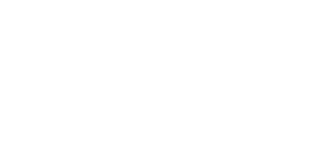

# BNOS — Bionic Neural Network Program Operating System

🌍 **Language**: **English** | [中文](README_CN.md)

<div align="center">




**A pure desktop visual node orchestration platform — build DAG workflows across languages and processes.**

</div>

---

## What is BNOS?

BNOS is a desktop application (PySide6) for visually orchestrating computational workflows as **directed acyclic graphs (DAGs)** of independent processes. Each node is a standalone program with its own virtual environment, written in any supported language (Python, Rust, etc.), communicating via a **file-based JSON protocol** with attention-mechanism filtering.

The platform provides a VSCode-style dark interface with an infinite canvas — drag nodes, wire them together, and manage their lifecycle with one click.

> Historical README archived at [docs/archived/README_v1_archived.md](docs/archived/README_v1_archived.md)

---

## Core Design

### 1. Code-First, Visual Orchestration

BNOS is not a low-code platform. Nodes are **real programs** — you write full source code in any IDE. The canvas is a visual orchestration layer on top: it manages wiring, data flow, and lifecycle.

### 2. Per-Node Process Isolation

Each node runs as an **independent OS process** with its own `venv/`. No shared runtime, no dependency conflicts. Crash one node, others stay alive. The platform monitors processes via PID files and periodic health polling.

### 3. File-Based JSON Communication

Nodes communicate by reading and writing `output.json` files. An upstream node writes its result; a downstream node polls it. **Attention filter rules** (`filter` in `node_config.json`) let each node selectively process only matching data types — enabling conditional DAG routing.

### 4. Composite Nodes — DAG Compression

The flagship feature. Select multiple nodes on the canvas, compress them into a **single composite node**. The platform:
- Validates the sub-DAG (single entry, no cycles)
- Generates an `orchestrator.py` that runs the internal DAG in topological order
- Creates an isolated composite `venv` by merging dependencies
- Manages port routing: external edges are remapped through the composite boundary

Composite nodes can be **expanded** (show internal structure) or **collapsed** (show as a single block). The orchestrator runs as a long-lived polling process and supports **hot-reload** of DAG topology via `.pipe` signal files.

---

## Architecture

```
launcher.py (tkinter splash)
  └─ bnos_console.py (main entry)
       └─ ApplicationContext (singleton service hub)
            ├─ EventBus  (pub-sub decoupling)
            ├─ DIContainer (dependency injection)
            ├─ PollingManager (status / log / config polling)
            ├─ ProcessManager (child process lifecycle)
            └─ NodeControlService (node start / stop)
       └─ BNOSMainWindow (8 Mixin modules)
            ├─ Canvas (QGraphicsView, viewport culling)
            │    ├─ NodeItem (3 styles: rect / dot / detailed)
            │    ├─ EdgeItem (bezier connections)
            │    └─ Drawing Layer + Parameter Widgets (11 types)
            ├─ Panels (node list, monitor, history, resource...)
            └─ CompositeNodeManager (compress / expand / orchestrate)
```

Each node on disk:
```
nodes/<name>/
  ├─ node_config.json   # listen_upper_file, filter, ports, parameters
  ├─ main.py            # processing logic (reads stdin JSON, writes stdout JSON)
  ├─ listener.py        # polling daemon: watch output.json → filter → invoke main.py
  ├─ output.json        # produced by main.py, consumed by downstream nodes
  └─ venv/              # isolated Python environment
```

---

## Quick Start

### Prerequisites

- Python 3.12+
- Windows 10/11 (primary), Linux/macOS (partial)

### Install & Run

```bash
git clone https://github.com/LiuStar656/BNOS---Bionic-Neural-Network-Visual-Orchestration-Platform.git
cd BNOS---Bionic-Neural-Network-Visual-Orchestration-Platform

# Create project virtual environment
python -m venv venv
venv\Scripts\activate      # Windows
# source venv/bin/activate # Linux/macOS

pip install -r requirements.txt

# Launch (with splash screen)
python launcher.py
# Or directly
python bnos_console.py
```

### First Workflow

1. **New Project** → select a folder (auto-creates `nodes/`)
2. **New Node** → name it, choose language → generates config + venv + entry scripts
3. **Add to Canvas** → right-click node in list
4. **Wire Nodes** → drag from **OUT** anchor (blue) to **IN** anchor (green)
5. **Start** → double-click node, click ▶️

---

## Key Features

### Visual Canvas
Infinite canvas with zoom (0.1x–5.0x), pan, box-select, multi-select, ComfyUI-style orthogonal edges with fold handles. Viewport culling and background caching for smooth 60fps interaction.

### Composite Node System
Compress sub-DAGs into reusable composite blocks. Auto-generates orchestrator scripts, isolated venvs, and port routing. Supports expand/collapse on canvas with full edge morphing — external connections are correctly remapped when the composite boundary changes.

### Multi-Language Nodes
Python nodes are fully supported. Rust nodes provided with self-healing builds and dual-binary architecture. Node.js, Go, Java, C++, Ruby node generators under development.

### Process Health Detection
PID file persistence with cross-session recovery. Periodic health polling (2s interval). Atomic `taskkill /F /T` for process tree termination. Zombie process detection via system scan fallback.

### Node Registry & External Mounts
Persistent `node_registry.json` tracks all nodes. External directories can be **mounted** (reference, not copy) into projects with locked-group protection. Safe unmount preserves source files.

### Startup Queue
Configurable concurrency control for batch node startup. Priority scheduling, automatic retry (3 attempts), persistent queue state.

### History Rollback
Command-pattern undo/redo for all canvas operations. Visual history panel shows operation timeline; click any entry to jump to that state.

### Photoshop-Style UI
VSCode dark theme, custom frameless title bar, floating panels, dock system, Toast notifications (FIFO queue, smart replacement), i18n (EN/CN), IDE auto-detection (VSCode, Trae).

---

## Project Structure

```
BNOS/
├── launcher.py                     # Splash screen launcher
├── bnos_console.py                 # Main entry (PySide6 app)
├── build_bnos.spec                 # PyInstaller packaging
│
├── ui/
│   ├── main_window/                # BNOSMainWindow + 8 Mixins
│   ├── core/
│   │   ├── node/
│   │   │   ├── composite_node.py   # ★ Composite DAG engine (~2800 lines)
│   │   │   ├── node_process.py     # Process lifecycle management
│   │   │   ├── node_registry.py    # Persistent node registration
│   │   │   ├── connection_inferrer.py
│   │   │   └── composite_orchestrator.py
│   │   ├── system/                 # EventBus, DI, PollingManager, IPC
│   │   ├── services/               # ApplicationContext, ProcessManager
│   │   ├── dock/                   # BNOS dock system
│   │   └── project/                # Project & file import/export
│   ├── canvas/                     # QGraphicsView canvas engine
│   │   ├── items/                  # NodeItem, EdgeItem, AnchorItem
│   │   ├── drawing/                # Drawing layer & toolbar
│   │   └── parameter_widgets/      # 11 parameter widget types
│   ├── panels/                     # Node list, monitor, history, etc.
│   └── dialogs/                    # Config, color, file browser dialogs
│
├── tools/                          # Node template generators (Python, Rust)
├── docs/                           # Documentation & changelogs
│   └── archived/                   # Historical README archives
└── nodes/                          # User-created nodes (runtime)
```

---

## Extending

### Add a new language
Register a generator in `tools/` and add detection in `ui/core/node/language_detector.py`.

### Add a custom node style
Subclass `NodeStyle` in `ui/canvas/items/styles/`, register in `StyleRegistry`.

### Add a new parameter widget
Subclass `ParameterWidget` in `ui/canvas/parameter_widgets/`, register in `WidgetRegistry`.

---

## Known Limitations

- DAG cycle detection is in place, but users should avoid circular wiring during expansion
- Moving project folders may break absolute paths
- 100+ nodes on canvas may impact performance
- Linux/macOS features partially tested

---

## License

MIT License © 2026 阿东与守一工作室 · [LICENSE](LICENSE)

---

<div align="center">

[Quick Start](#quick-start) · [Architecture](#architecture) · [Features](#key-features) · [Structure](#project-structure)

</div>
