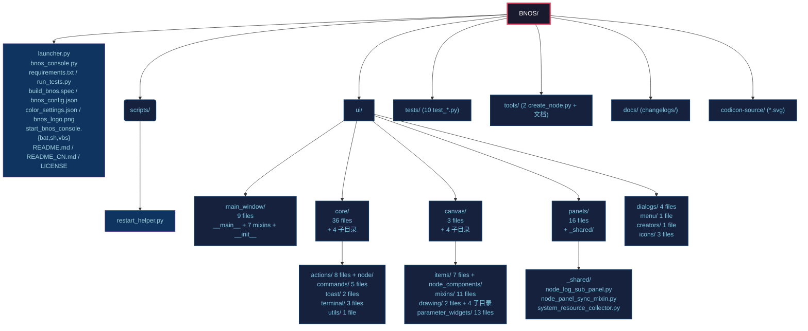
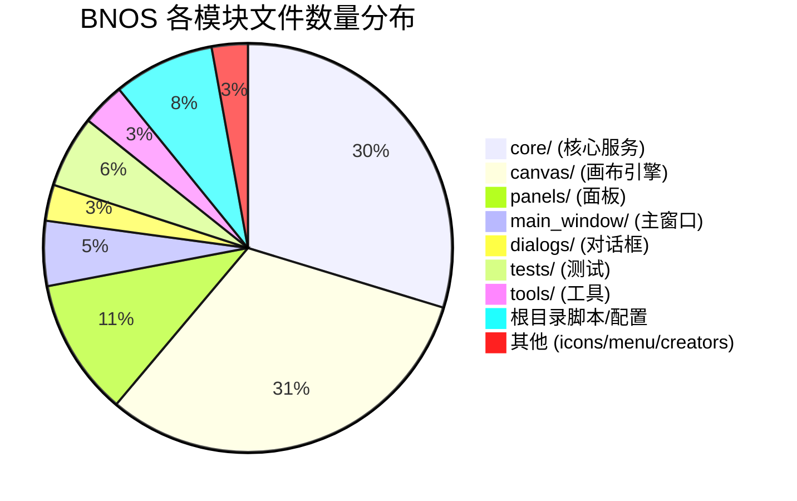

# BNOS 文件结构图 (Mermaid)

> 仅展示项目文件/目录的组织结构，不含逻辑关系。

---

```mermaid
graph LR
    ROOT("BNOS/ (项目根)"):::root

    ROOT --> S1["launcher.py"]:::file
    ROOT --> S2["bnos_console.py"]:::file
    ROOT --> S4["requirements.txt"]:::file
    ROOT --> SCRIPTS("scripts/"):::dir
    SCRIPTS --> S3["restart_helper.py"]:::file
    ROOT --> S5["run_tests.py"]:::file
    ROOT --> S6["build_bnos.spec"]:::file
    ROOT --> S7["bnos_config.json"]:::file
    ROOT --> S8["color_settings.json"]:::file
    ROOT --> S9["bnos_logo.png"]:::file
    ROOT --> S10["README.md / README_CN.md / LICENSE"]:::file

    ROOT --> BAT["start_bnos_console.bat<br/>start_bnos_console.sh<br/>start_bnos_console.vbs"]:::file

    ROOT --> UI("ui/"):::dir
    ROOT --> TESTS("tests/"):::dir
    ROOT --> TOOLS("tools/"):::dir
    ROOT --> DOCS("docs/"):::dir
    ROOT --> CODICON("codicon-source/"):::dir

    UI --> UI_INIT["__init__.py"]:::file
    UI --> UI_APP["app_config.json"]:::file
    UI --> UI_CW["canvas_widget.py"]:::file

    UI --> MW("main_window/"):::dir
    UI --> CORE("core/"):::dir
    UI --> CV("canvas/"):::dir
    UI --> PNL("panels/"):::dir
    UI --> DLG("dialogs/"):::dir
    UI --> MNU("menu/"):::dir
    UI --> CRT("creators/"):::dir
    UI --> IC("icons/"):::dir

    MW --> MW1["__init__.py"]:::file
    MW --> MW2["__main__.py"]:::file
    MW --> MW3["state.py"]:::file
    MW --> MW4["lifecycle.py"]:::file
    MW --> MW5["actions.py"]:::file
    MW --> MW6["panel.py"]:::file
    MW --> MW7["ipc.py"]:::file
    MW --> MW8["node.py"]:::file
    MW --> MW9["interaction.py"]:::file

    CORE --> CORE_F1["event_bus.py"]:::file
    CORE --> CORE_F2["di.py"]:::file
    CORE --> CORE_F3["logger.py"]:::file
    CORE --> CORE_F4["app_config.py"]:::file
    CORE --> CORE_F5["theme.py"]:::file
    CORE --> CORE_F6["i18n.py"]:::file
    CORE --> CORE_F7["strings_cn.json / strings_en.json"]:::file
    CORE --> CORE_F8["application_context.py"]:::file
    CORE --> CORE_F9["dark_title_bar.py"]:::file
    CORE --> CORE_F10["canvas_host.py"]:::file
    CORE --> CORE_F11["project_manager.py"]:::file
    CORE --> CORE_F12["project_load_worker.py"]:::file
    CORE --> CORE_F13["node_control_service.py"]:::file
    CORE --> CORE_F14["node_registry.py"]:::file
    CORE --> CORE_F15["node_process.py"]:::file
    CORE --> CORE_F16["node_creation_worker.py"]:::file
    CORE --> CORE_F17["node_config_parser.py"]:::file
    CORE --> CORE_F18["json_node_starter.py"]:::file
    CORE --> CORE_F19["external_node_manager.py"]:::file
    CORE --> CORE_F20["connection_inferrer.py"]:::file
    CORE --> CORE_F21["shutdown_orchestrator.py"]:::file
    CORE --> CORE_F22["panel_manager.py"]:::file
    CORE --> CORE_F23["dock_manager.py"]:::file
    CORE --> CORE_F24["process_manager.py"]:::file
    CORE --> CORE_F25["polling_manager.py"]:::file
    CORE --> CORE_F26["shortcut_manager.py"]:::file
    CORE --> CORE_F27["window_state_manager.py"]:::file
    CORE --> CORE_F28["file_operation_manager.py"]:::file
    CORE --> CORE_F29["import_export_manager.py"]:::file
    CORE --> CORE_F30["splash_screen.py"]:::file
    CORE --> CORE_F31["validators.py"]:::file
    CORE --> CORE_F32["ipc.py"]:::file
    CORE --> CORE_F33["core_process.py"]:::file
    CORE --> CORE_F34["bnos_dock.py"]:::file
    CORE --> CORE_F35["floating_panel.py"]:::file
    CORE --> CORE_F36["packager.py"]:::file

    CORE --> CORE_ACT("actions/"):::dir
    CORE --> CORE_CMD("commands/"):::dir
    CORE --> CORE_TOAST("toast/"):::dir
    CORE --> CORE_TERM("terminal/"):::dir
    CORE --> CORE_UTIL("utils/"):::dir

    CORE_ACT --> ACT1["action_definition.py"]:::file
    CORE_ACT --> ACT2["action_registry.py"]:::file
    CORE_ACT --> ACT3["action_factory.py"]:::file
    CORE_ACT --> ACT4["builtin_canvas_actions.py"]:::file
    CORE_ACT --> ACT5["builtin_node_actions.py"]:::file
    CORE_ACT --> ACT6["builtin_project_actions.py"]:::file
    CORE_ACT --> ACT7["builtin_view_actions.py"]:::file
    CORE_ACT --> ACT_NODE("node/"):::dir
    ACT_NODE --> ACTN["start/stop/restart 等"]:::file

    CORE_CMD --> CMD1["base.py"]:::file
    CORE_CMD --> CMD2["node_commands.py"]:::file
    CORE_CMD --> CMD3["edge_commands.py"]:::file
    CORE_CMD --> CMD4["compound_commands.py"]:::file
    CORE_CMD --> CMD5["history_manager.py"]:::file

    CORE_TOAST --> T1["toast_notification.py"]:::file
    CORE_TOAST --> T2["toast_queue_manager.py"]:::file

    CORE_TERM --> TERM1["terminal_dock.py"]:::file
    CORE_TERM --> TERM2["terminal_widget.py"]:::file
    CORE_TERM --> TERM3["terminal_process.py"]:::file

    CORE_UTIL --> UTIL1["dialog_utils.py"]:::file

    CV --> CV1["__init__.py"]:::file
    CV --> CV2["canvas_view.py"]:::file
    CV --> CV3["canvas_process.py"]:::file

    CV --> CV_ITEMS("items/"):::dir
    CV --> CV_MIXINS("mixins/"):::dir
    CV --> CV_DRAW("drawing/"):::dir
    CV --> CV_PARAM("parameter_widgets/"):::dir

    CV_ITEMS --> IT1["node_item.py"]:::file
    CV_ITEMS --> IT2["edge_item.py"]:::file
    CV_ITEMS --> IT3["anchor_item.py"]:::file
    CV_ITEMS --> IT4["anchor_manager.py"]:::file
    CV_ITEMS --> IT5["node_status_widget.py"]:::file
    CV_ITEMS --> IT6["node_style.py"]:::file
    CV_ITEMS --> IT_COMP("node_components/"):::dir
    IT_COMP --> ITC["header / body / port_area<br/>status_badge / resize_handle"]:::file

    CV_MIXINS --> MX1["canvas_event_handlers.py"]:::file
    CV_MIXINS --> MX2["canvas_connections.py"]:::file
    CV_MIXINS --> MX3["canvas_node_manager.py"]:::file
    CV_MIXINS --> MX4["canvas_selection.py"]:::file
    CV_MIXINS --> MX5["canvas_box_select.py"]:::file
    CV_MIXINS --> MX6["canvas_menus.py"]:::file
    CV_MIXINS --> MX7["canvas_batch_ops.py"]:::file
    CV_MIXINS --> MX8["canvas_layout.py"]:::file
    CV_MIXINS --> MX9["canvas_colors.py"]:::file
    CV_MIXINS --> MX10["canvas_background_renderer.py"]:::file
    CV_MIXINS --> MX11["controllers.py"]:::file

    CV_DRAW --> DR1["draw_toolbar.py"]:::file
    CV_DRAW --> DR2["draw_layer.py"]:::file
    CV_DRAW --> DR_DIR1("tools/"):::dir
    CV_DRAW --> DR_DIR2("styles/"):::dir
    CV_DRAW --> DR_DIR3("components/"):::dir
    CV_DRAW --> DR_DIR4("graphic_items/"):::dir

    CV_PARAM --> PW1["_base.py"]:::file
    CV_PARAM --> PW2["_proxy_combo.py"]:::file
    CV_PARAM --> PW3["string.py"]:::file
    CV_PARAM --> PW4["int_widget.py"]:::file
    CV_PARAM --> PW5["float_widget.py"]:::file
    CV_PARAM --> PW6["bool_widget.py"]:::file
    CV_PARAM --> PW7["color_widget.py"]:::file
    CV_PARAM --> PW8["enum_widget.py"]:::file
    CV_PARAM --> PW9["password.py"]:::file
    CV_PARAM --> PW10["text.py"]:::file
    CV_PARAM --> PW11["range_widget.py"]:::file
    CV_PARAM --> PW12["file_picker.py"]:::file
    CV_PARAM --> PW13["dir_picker.py"]:::file

    PNL --> P1["node_list_dock.py"]:::file
    PNL --> P2["node_list_panel.py"]:::file
    PNL --> P3["node_list_context.py"]:::file
    PNL --> P4["node_list_drag.py"]:::file
    PNL --> P5["node_list_ops.py"]:::file
    PNL --> P6["node_expand_panel.py"]:::file
    PNL --> P7["node_group_manager.py"]:::file
    PNL --> P8["_node_tree_widget.py"]:::file
    PNL --> P9["resource_monitor_dock.py"]:::file
    PNL --> P10["resource_monitor.py"]:::file
    PNL --> P11["node_monitor_dock.py"]:::file
    PNL --> P12["node_monitor.py"]:::file
    PNL --> P13["history_panel.py"]:::file
    PNL --> P14["property_panel.py"]:::file
    PNL --> P15["panel_process.py"]:::file
    PNL --> PNL_SHARED("_shared/"):::dir
    PNL_SHARED --> PS1["node_log_sub_panel.py"]:::file
    PNL_SHARED --> PS2["node_panel_sync_mixin.py"]:::file
    PNL_SHARED --> PS3["system_resource_collector.py"]:::file

    DLG --> D1["settings_dialog.py"]:::file
    DLG --> D2["color_settings_dialog.py"]:::file
    DLG --> D3["node_config_dialog.py"]:::file
    DLG --> D4["file_browser_dialog.py"]:::file

    MNU --> MN1["menu_manager.py"]:::file

    CRT --> CR1["node_creator_manager.py"]:::file

    IC --> IC1["__init__.py"]:::file
    IC --> IC2["codicon.py"]:::file
    IC --> IC3["codicon.ttf"]:::file

    TESTS --> TST1["test_event_bus.py"]:::file
    TESTS --> TST2["test_di_container.py"]:::file
    TESTS --> TST3["test_app_config.py"]:::file
    TESTS --> TST4["test_canvas_process.py"]:::file
    TESTS --> TST5["test_core_process.py"]:::file
    TESTS --> TST6["test_panel_process.py"]:::file
    TESTS --> TST7["test_polling_manager.py"]:::file
    TESTS --> TST8["test_validators.py"]:::file
    TESTS --> TST9["test_terminal_feature.py"]:::file

    TOOLS --> TL1["python_create_node.py"]:::file
    TOOLS --> TL2["rust_create_node.py"]:::file
    TOOLS --> TL3["bnos.py.node.pack"]:::file
    TOOLS --> TL4["开发准则文档 .md"]:::file

    DOCS --> DOC_CHG("changelogs/"):::dir

    classDef root fill:#1a1a2e,stroke:#e94560,color:#fff,stroke-width:3px
    classDef dir fill:#16213e,stroke:#0f3460,color:#7ec8e3,stroke-width:2px
    classDef file fill:#0f3460,stroke:#533483,color:#a0d2db,stroke-width:1px
```

---

## 精简版 (树形结构)

```mermaid
graph TB
    R["BNOS/"]:::root
    R --> R1["launcher.py<br/>bnos_console.py<br/>requirements.txt / run_tests.py<br/>build_bnos.spec / bnos_config.json<br/>color_settings.json / bnos_logo.png<br/>start_bnos_console.{bat,sh,vbs}<br/>README.md / README_CN.md / LICENSE"]:::file
    R --> SCRIPTS("scripts/"):::dir
    SCRIPTS --> R_H["restart_helper.py"]:::file

    R --> UI["ui/"]:::dir
    R --> TESTS["tests/ (10 test_*.py)"]:::dir
    R --> TOOLS["tools/ (2 create_node.py + 文档)"]:::dir
    R --> DOCS["docs/ (changelogs/)"]:::dir
    R --> CODICON["codicon-source/ (*.svg)"]:::dir

    UI --> MW["main_window/<br/>9 files<br/>__main__ + 7 mixins + __init__"]:::dir
    UI --> CORE["core/<br/>36 files<br/>+ 4 子目录"]:::dir
    UI --> CV["canvas/<br/>3 files<br/>+ 4 子目录"]:::dir
    UI --> PNL["panels/<br/>16 files<br/>+ _shared/"]:::dir
    UI --> OTH["dialogs/ 4 files<br/>menu/ 1 file<br/>creators/ 1 file<br/>icons/ 3 files"]:::dir

    CORE --> CORE_SUB["actions/ 8 files + node/<br/>commands/ 5 files<br/>toast/ 2 files<br/>terminal/ 3 files<br/>utils/ 1 file"]:::dir

    CV --> CV_SUB["items/ 7 files + node_components/<br/>mixins/ 11 files<br/>drawing/ 2 files + 4 子目录<br/>parameter_widgets/ 13 files"]:::dir

    PNL --> PNL_SUB["_shared/<br/>node_log_sub_panel.py<br/>node_panel_sync_mixin.py<br/>system_resource_collector.py"]:::dir

    classDef root fill:#1a1a2e,stroke:#e94560,color:#fff,stroke-width:3px
    classDef dir fill:#16213e,stroke:#0f3460,color:#7ec8e3,stroke-width:2px
    classDef file fill:#0f3460,stroke:#533483,color:#a0d2db,stroke-width:1px
```

---

## 文件数量统计

```mermaid
pie title BNOS 各模块文件数量分布
    "core/ (核心服务)" : 52
    "canvas/ (画布引擎)" : 55
    "panels/ (面板)" : 19
    "main_window/ (主窗口)" : 9
    "dialogs/ (对话框)" : 5
    "tests/ (测试)" : 10
    "tools/ (工具)" : 6
    "根目录脚本/配置" : 14
    "其他 (icons/menu/creators)" : 5
```

---

> 本文档仅展示文件/目录的组织结构，不含模块间的逻辑依赖关系。  
> 逻辑架构图请参见 `docs/BNOS_架构图.md`。
