# BNOS 完整架构图 (Mermaid)

> **BNOS** (Bionic Neural Network Program Operating System) — 基于 PySide6 的桌面端可视化节点编排平台  
> 生成日期：2026-06-18

---

## 一、启动流程链

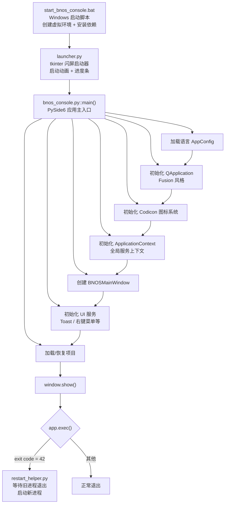

---

## 二、整体分层架构

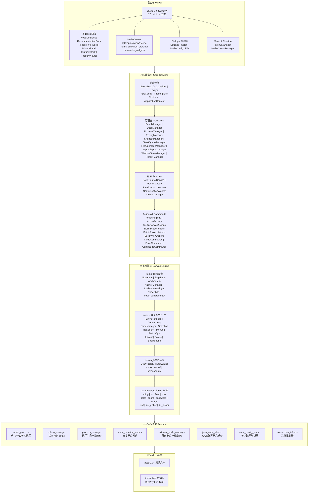

---

## 三、主窗口 Mixin 架构

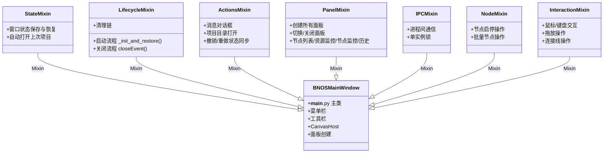

---

## 四、画布 NodeCanvas 详细架构

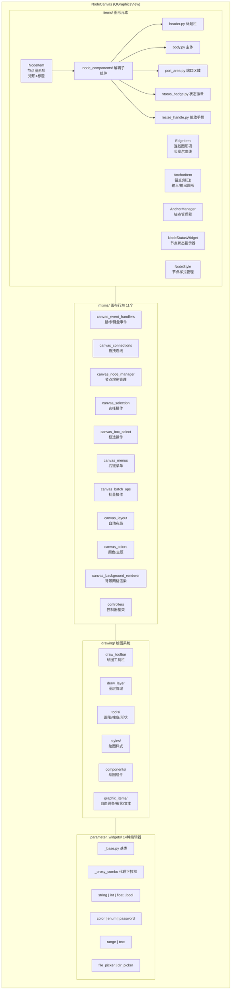

---

## 五、面板系统架构

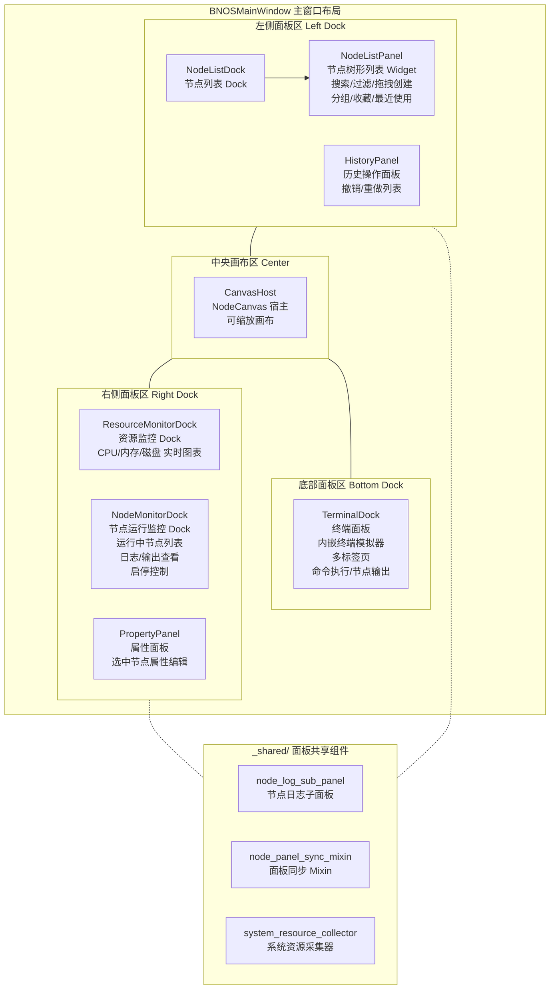

---

## 六、核心服务架构

### 6.1 事件总线 EventBus

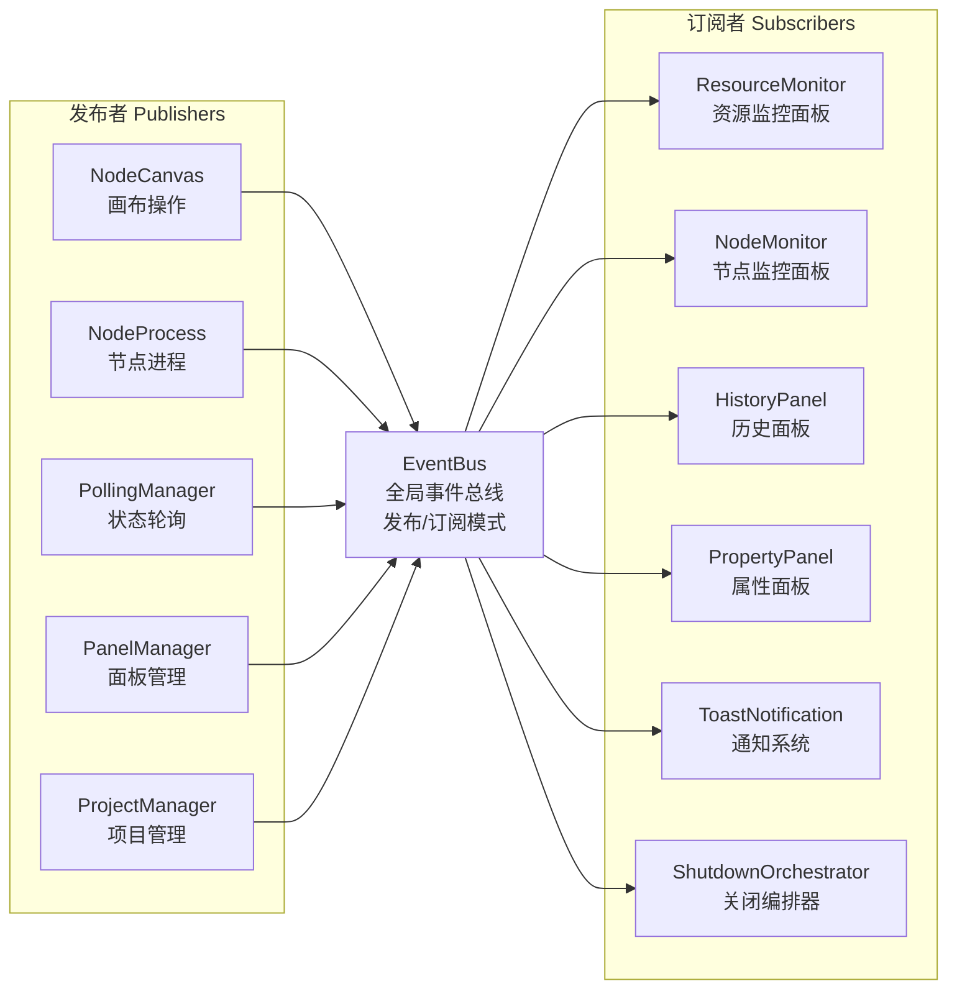

### 6.2 依赖注入 DI Container

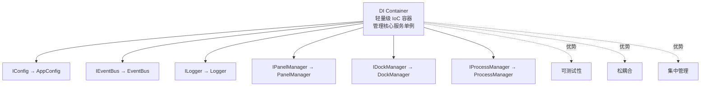

### 6.3 Actions & Commands 系统

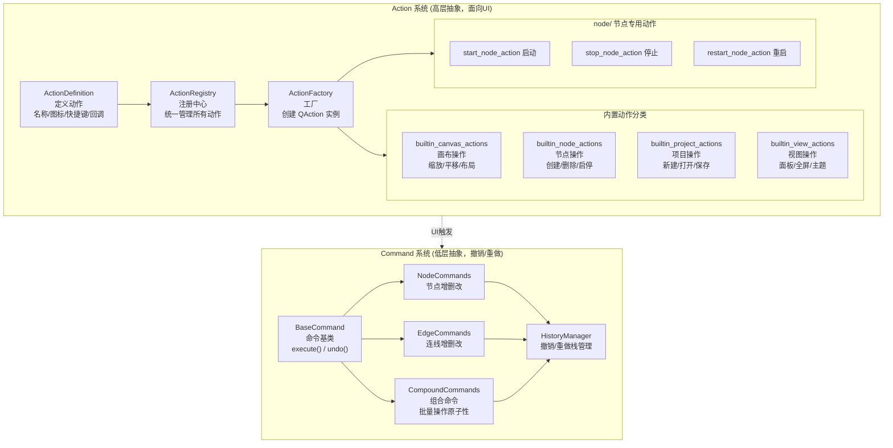

---

## 七、数据流图

### 7.1 节点创建流程

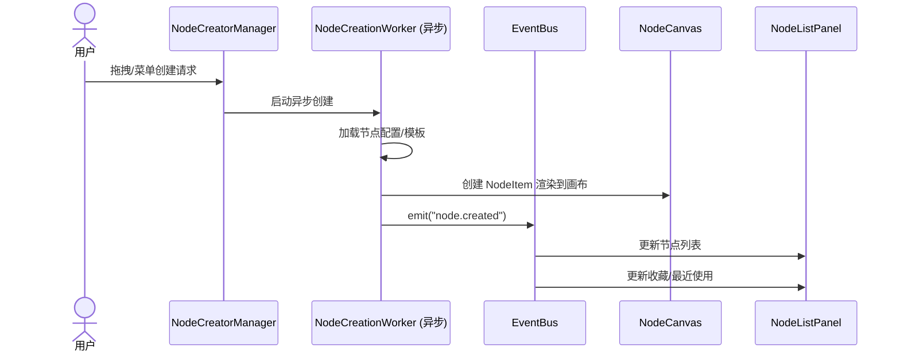

### 7.2 节点运行流程

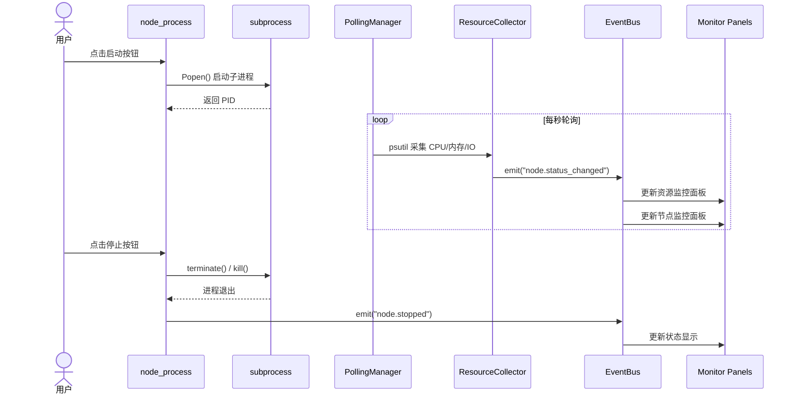

### 7.3 项目保存/加载流程

```mermaid
sequenceDiagram
    actor User as 用户
    participant PM as ProjectManager
    participant PW as ProjectLoadWorker (异步)
    participant FS as 文件系统 (JSON)
    participant CV as NodeCanvas
    participant EB as EventBus

    rect rgb(40, 60, 40)
        Note over User,FS: 保存流程
        User->>PM: 保存操作
        PM->>CV: 收集节点/连线数据
        CV-->>PM: 返回数据
        PM->>FS: JSON 序列化写入 canvas_layout.json
        FS-->>PM: 保存完成
    end

    rect rgb(60, 40, 40)
        Note over User,FS: 加载流程
        User->>PM: 打开项目
        PM->>PW: 启动异步加载
        PW->>FS: JSON 反序列化读取
        FS-->>PW: 返回数据
        PW->>CV: 批量重建 NodeItem + EdgeItem
        PW->>EB: emit("project.opened")
        EB->>CV: 刷新画布
    end
```

### 7.4 撤销/重做流程

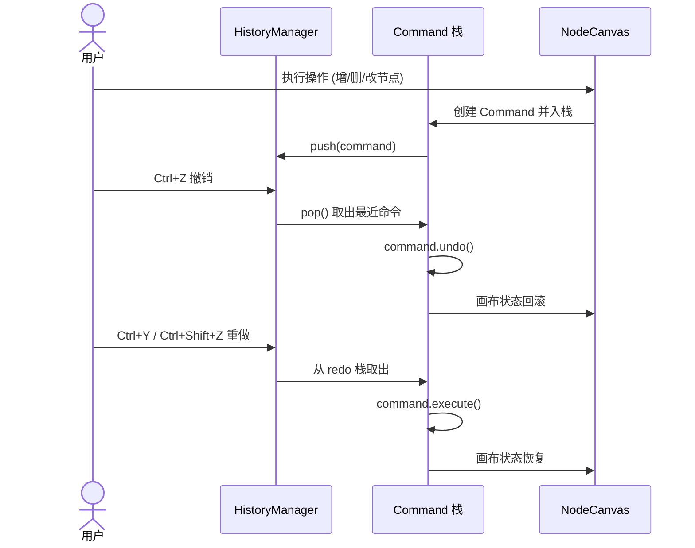

### 7.5 安全关闭流程

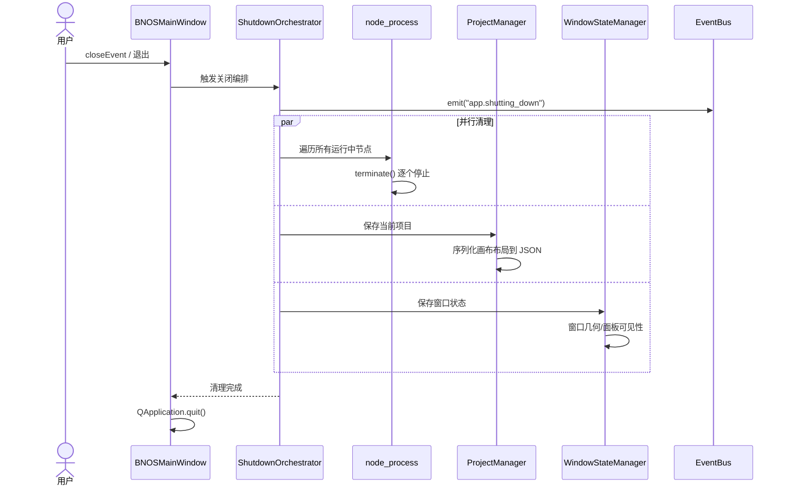

---

## 八、模块依赖关系图

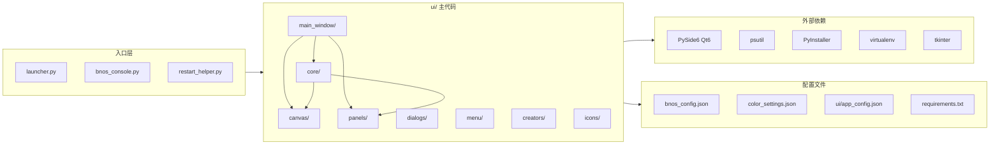

---

## 九、技术栈

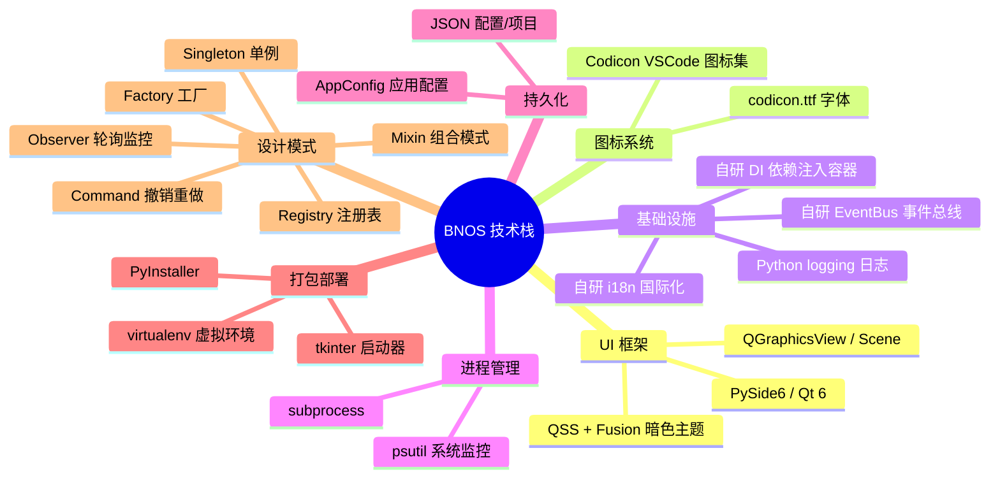

---

## 十、设计模式应用总览

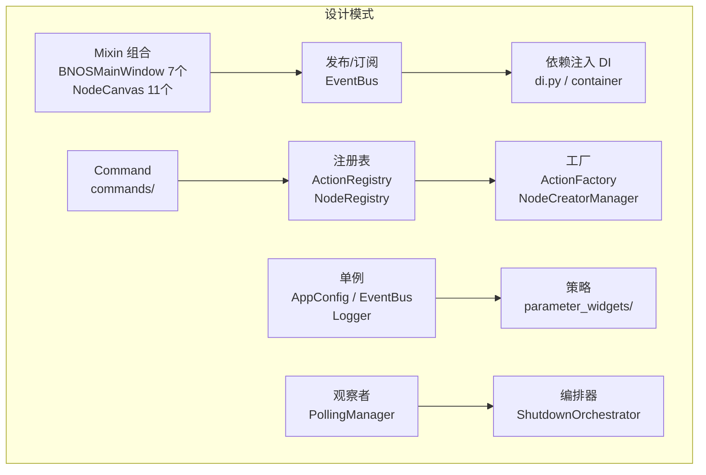

---

> 本文档使用 Mermaid 语法生成，可在支持 Mermaid 的 Markdown 渲染器中直接查看图表。
